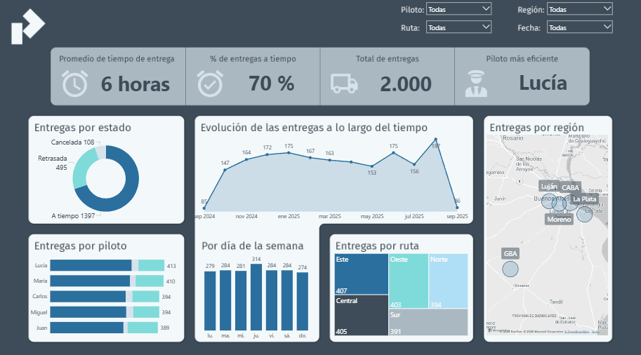

### 📦 Mini-Dashboard de Logística y Transporte

## 📖 Descripción

Este proyecto simula un escenario de logística y transporte con un pequeño dataset de 2.000 registros.
El objetivo fue construir un dashboard en Power BI para analizar la eficiencia de entregas, con foco en tiempos, cumplimiento de rutas y desempeño por piloto y región.

## 📺 Resultado final

## 📊 KPIs principales

🚚 Total de entregas

⏱️ Promedio de tiempo de entrega

📦 % de entregas a tiempo

✅ Piloto más eficiente

## 🛠️ Proceso de trabajo

- Generación de dataset con entregas, rutas, pilotos y estados
- Simulación y limpieza de datos
- Estandarización de campos categóricos
- Creación de tabla calendario
- Modelado de datos en Power BI
- Creación de tabla calendario con DAX
- Medidas DAX
- Visualizaciones
- Creación de tooltip personalizado a cada visual

## 📱 Contacto
📧 gaston.pelo.contacto@gmail.com   
💼 [LinkedIn](https://www.linkedin.com/in/gpelo-data/)  